# Vegan Bliss     

The live website can be found here - [Vegan Bliss](https://Danut89.github.io/ProjectMilestone1-Vegan-Bliss/)

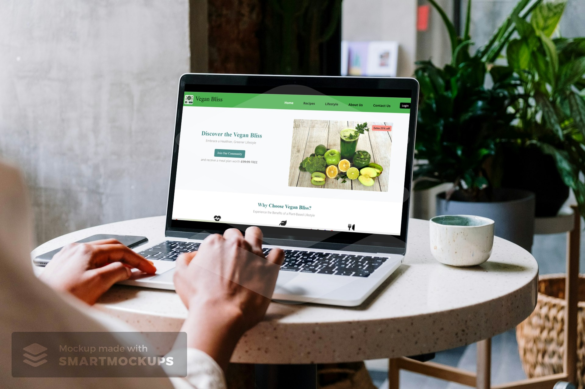

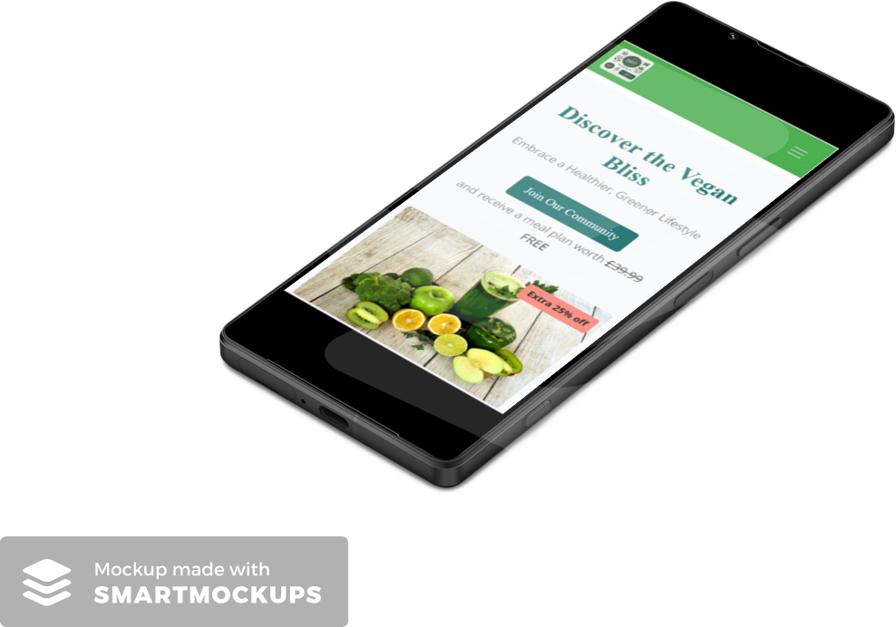 

### Introduction

Welcome to Vegan Bliss, your ultimate destination for embracing a healthier and greener lifestyle through delicious plant-based recipes and insightful tips on vegan living. 
Explore our curated collection of vegan recipes, learn about the health benefits of a vegan diet, and join our vibrant community dedicated to making a positive impact on the planet.


## User Experience (UX)

### Project Scope
The primary goal of Vegan Bliss is to provide users with an engaging platform to discover vegan recipes, learn about the benefits of a vegan diet, and get tips on vegan meal preparation.

### User Demographics
The primary users of the Vegan Bliss site are individuals interested in adopting a vegan lifestyle. This demographic includes a wide range of ages and backgrounds, from health-conscious individuals to those passionate about animal welfare and environmental sustainability. The site should have a clean, appealing design to attract and retain these users. As they are particularly interested in nutrition and lifestyle, a modern and inviting design is crucial.

### User Requirements
- **Visually Engaging**: The site should be aesthetically pleasing with vibrant images of vegan dishes and a clean layout.
- **Easy to Navigate**: The layout should be intuitive, allowing users to easily find recipes, health benefits, and lifestyle tips.
- **Clear Information Layout**: Information should be presented in a straightforward, easy-to-understand manner.
- **Responsive Design**: The site must be accessible and fully functional on mobile, tablet, and desktop devices.


### User Stories

### Target Audience
- Individuals looking to adopt a vegan lifestyle
- People seeking healthy and nutritious vegan recipes
- Individuals interested in the health benefits of a plant-based diet
- Those looking for efficient vegan meal prep tips

### General Visitors
- **As a user**, I want to easily navigate through different sections of the website.
- **As a user**, I want to find a variety of vegan recipes that are easy to make.
- **As a user**, I want to learn about the health benefits of a vegan diet.
- **As a user**, I want to get tips on how to prepare vegan meals efficiently.

#### First Time Visitor Goals
- **As a First Time Visitor,** I want to easily understand the main purpose of the site and learn more about the benefits of a vegan lifestyle.
- **As a First Time Visitor,** I want to be able to easily navigate throughout the site to find content on vegan recipes and health tips.
- **As a First Time Visitor,** I want to find detailed information about vegan meal prep tips and the health benefits of a vegan diet.

#### Returning Visitor Goals
- **As a Returning Visitor,** I want to easily access the section of the site where I can contact the organization with queries.
- **As a Returning Visitor,** I want to easily access the section of the site where I can download vegan recipes.
- **As a Returning Visitor,** I want to locate the business's social media links to see their followings on social media to determine how trusted and known they are, and potentially look for testimonials on these sites to understand how previous users have benefited from the content.

#### Frequent User Goals
- **As a Frequent User,** I want to be able to access the site easily from any device, even if I am on the go.
- **As a Frequent User,** I want to follow Vegan Bliss on their social pages so I am aware of any updates or new recipes.
- **As a Frequent User,** I want to have quick access to new and updated recipes and health tips.


## Site Owner Goals

As the site owner of Vegan Bliss, my objectives are centered around creating an engaging, user-friendly, and effective platform that meets both my business needs and the expectations of my users. Below are the detailed goals I aim to achieve:

- **As a site owner,** I want to create an attractive and well-designed site that elicits a positive emotional response in users, encouraging them to remain on and navigate throughout the site to achieve their goals.
- **As a site owner,** I want to provide a diverse range of vegan recipes and lifestyle tips to offer valuable content that supports users in their journey towards a healthier, greener lifestyle.
- **As a site owner,** I want to foster a sense of community through interactive features such as newsletter subscriptions, downloadable recipes, and special offers.
- **As a site owner,** I want to ensure intuitive navigation and a user-friendly interface, making it easy for users to find the information they need.
- **As a site owner,** I want to have a clear and well-structured contact form so I can receive queries and questions from users, which will potentially lead to more engagement.
- **As a site owner,** I want to have clear social media links displayed on the site to increase following on channels and help with branding.
- **As a site owner,** I want to offer a login feature for personalized user experiences, enhancing interaction and engagement on the site.


## Features

### General Features
- **Responsive Design**: Ensures a seamless user experience across all devices, from desktops to mobile phones.
- **Navigation Bar**: Easy-to-use navigation bar with links to different sections of the site, ensuring smooth navigation.
- **Hero Section**: Engaging hero section with an attractive background image, compelling title, and a prominent call-to-action 
- **Join Our Community Button**: Encourages users to subscribe to our mailing list for the latest promotions and updates.
- **Login Button**: Provides easy access for returning users to log in and manage their profiles or access exclusive content.             
- **Footer**: Informative footer with social media links, providing additional ways for users to connect.

### Specific Features

- **Recipe Section**: 
  - **Variety of Recipes**: Showcases a diverse range of vegan recipes, each with detailed instructions and images.
  - **Downloadable Recipes**: Allows users to download recipes in PDF format for offline use.
  - **Interactive Modals**: Provides additional information through modal popups, enhancing the user experience.

- **Health Benefits**: 
  - **Informative Content**: Detailed information on the health benefits of a vegan diet, including weight loss, improved 
                             digestion, and more.
  - **Embedded Videos**: Engaging video content to complement the textual information.

- **Meal Prep Tips**: 
  - **Efficient Planning**: Tips on how to effectively plan and prepare vegan meals, ensuring balanced nutrition.
  - **Nutritional Information**: Nutritional breakdowns for each meal, helping users make informed choices.

### Interactive Features
 
  - **User-Friendly Contact Form**: Allows users to easily send inquiries or feedback.
  - **Google Maps Integration**: Embedded Google Maps to show the physical location of the business.
  - **Custom Animations**: Various CSS animations for buttons and images to draw attention and improve user interaction.


## Structure
The site has 4 main pages + a succes message page:
### Nav Bar

- **Navigation**: The navbar includes links to essential sections of the website such as Home, Recipes, Lifestyle, About Us, and Contact Us, ensuring easy and intuitive navigation.
- **Branding**: Features a distinct logo image and text to reinforce the Vegan Bliss brand identity.
- **Sticky Design**: The navbar remains fixed at the top of the page while scrolling, providing constant access to navigation links.
- **Responsive Design**: The navbar is fully responsive with a collapsible menu for smaller screens, maintaining a user-friendly experience across all devices.
- **Styling**: Styled with a green (#4CAF50) background, the navbar links change color on hover to enhance the visual feedback for users.
- **Login Button**: Includes a 'Login' button that triggers a modal for user authentication, styled to stand out with an outline and hover effect.
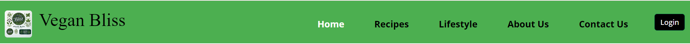

### Home Page
- **Hero Image**: Features a visually appealing hero image of vegan dishes.
- **Call to Action**:"Join Our Community" opens a subscription modal.
- **Benefits Section**: Benefits of a vegan lifestyle.
- **About Us**: Contains a brief introduction and background of Vegan Bliss.
- **Testimonials Section**: User testimonials.
- **Subscribe Section**: Invitation to join the mailing list.
- **Footer Section**: Icons for Facebook, Twitter, YouTube, and Instagram.
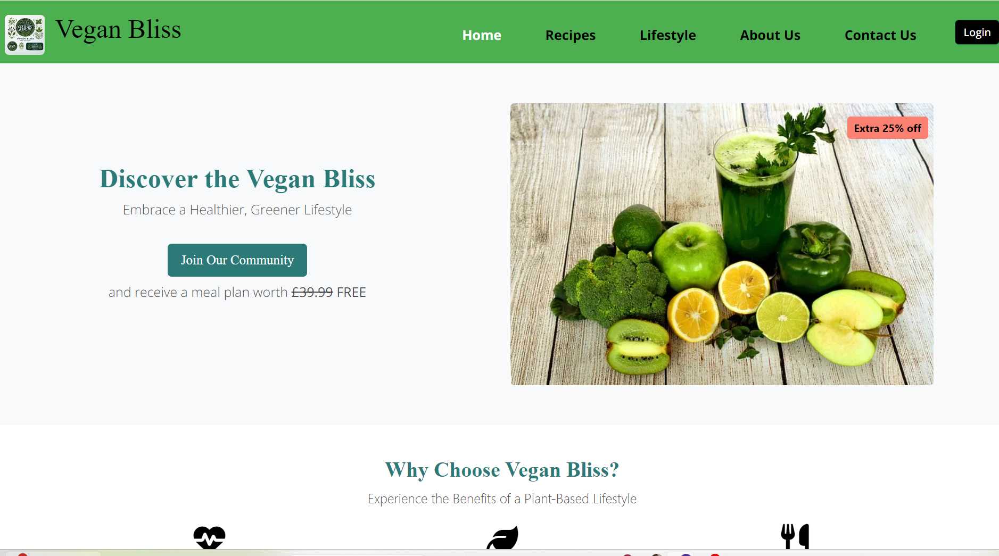

### Recipes Page
- **Recipe Listings**: Showcases a variety of vegan recipes with images and detailed instructions.
- **Download Options**: Provides downloadable recipes in PDF format.
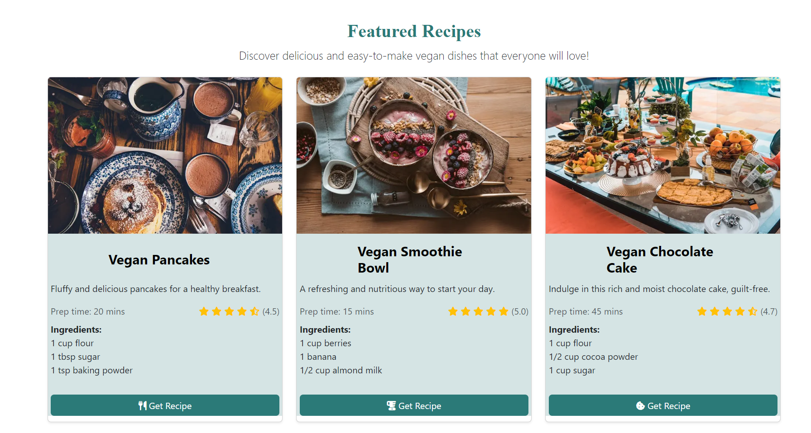

### Lifestyle Page
- **Health Benefits**: Information about the health benefits of a vegan diet, including weight loss and improved digestion.
- **Interactive Modals**: Contains modals for additional information.
- **Meal Prep Tips**: Tips on efficiently planning and preparing vegan meals.
- **Embedded Videos**: Includes videos for more engaging content.
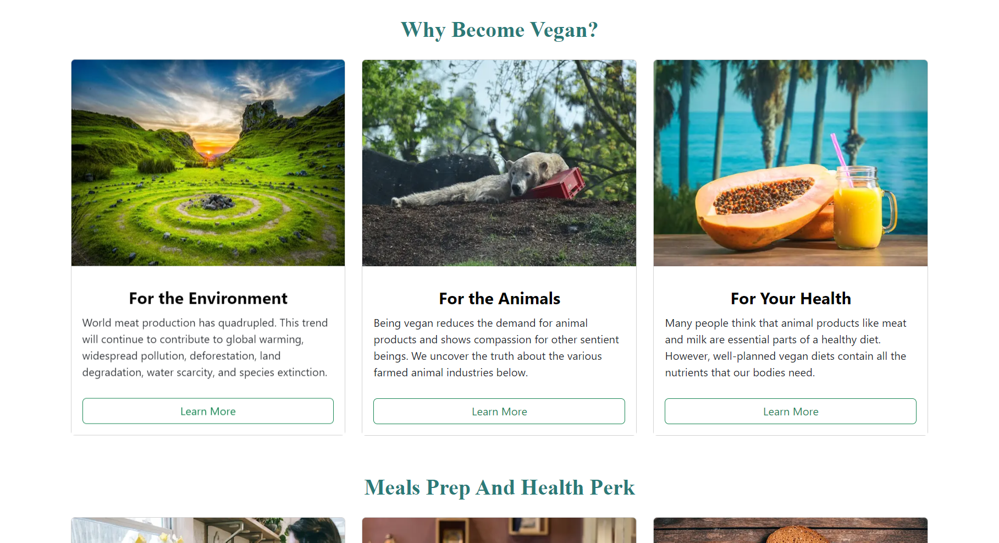

### Contact Page
- **Contact Form**: A user-friendly form for inquiries and feedback.
- **Google Maps Integration**: Displays a map for the physical location.
- **Contact Information**: Lists phone number, address, and email.
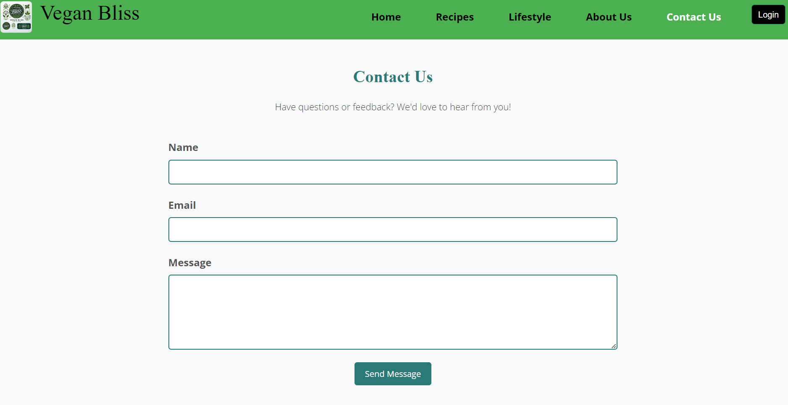
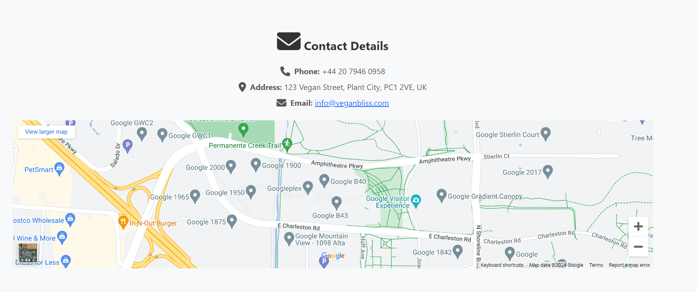

### Footer Section
- **Mailing List Subscription**: Encourages users to subscribe for updates on promotions, new products, and offers.
- **Social Media Links**: Provides easy access to follow Vegan Bliss on popular social media platforms including Facebook, - - Twitter, YouTube, and Instagram.
- **Copyright Information**: Displays the © 2024 Vegan Bliss, Inc to indicate ownership and the year of the content.
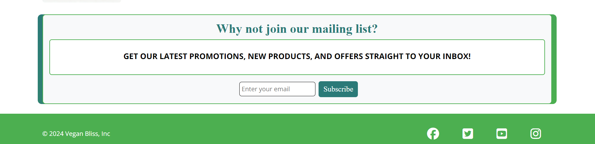

For consistency of user experience, the site logo, navigation links, and footer remain consistent throughout the site.

### Success Page
- **Confirmation Message**: Displays a thank you message after successful form submissions.
- **Return to Home Button**: Provides a button to navigate back to the home page.
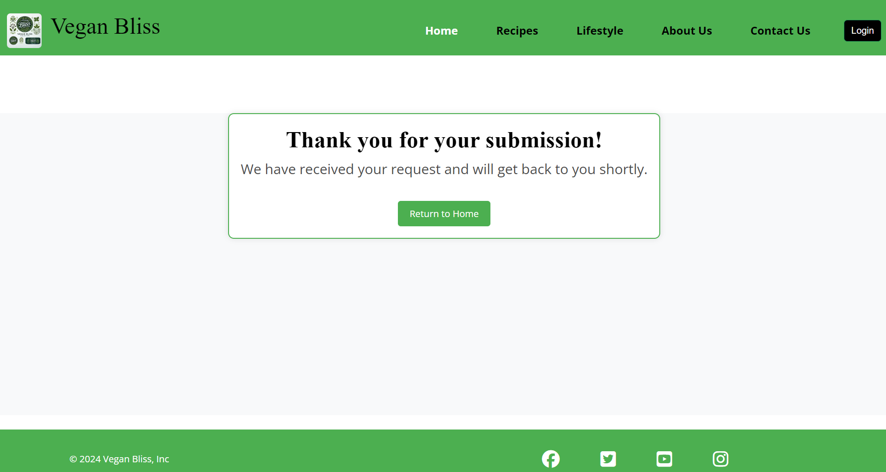

## Design

### Colour Scheme
The colour palette was chosen using the Coolors colour generator website to reflect the fresh and natural vibe of Vegan Bliss.
The website uses a fresh and natural color palette that reflects the vegan lifestyle, including shades of green, beige, and white.
  ### The colours mainly used were:

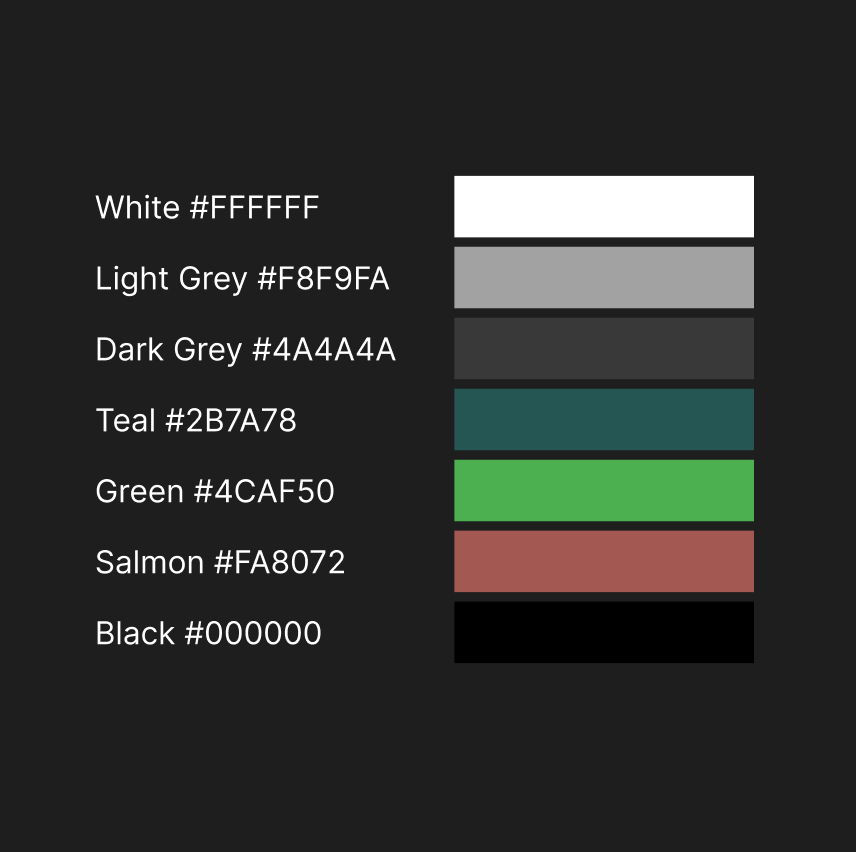                                            

### Typography
- **Primary Font**: 'Roboto', taken from Google Fonts, is used throughout the website for its readability and modern look.
- **Secondary Font**: 'Open Sans', also from Google Fonts, is used to create a clear distinction between content areas.

### Imagery
- All images were sourced from [Pexels](https://www.pexels.com/), [Pixabay](https://www.pixabay.com/), and [Unsplash](https://www.unsplash.com/).
- The main image on the home page features vibrant vegan dishes, intended to attract and engage visitors.
- Images on the Recipes page provide a visual preview of each dish, encouraging users to explore the recipes.
- The Contact page includes a Google Maps embed for easy location identification.


## Wireframes

Mock-ups were made using Balsamiq and Figma to help plan and visualize the site design. They were created for 3 main screen sizes: mobile, tablet, and desktop.

- [Wireframes: Home Page](./assets/readme-screenshoots/home-wireframe.png)
- [Wireframes: Recipes Page](./assets/readme-screenshoots/recipe-wireframe.png)
- [Wireframes: Lifestyle Page](./assets/readme-screenshoots/lifestyle-wireframe.png)
- [Wireframes: Contact Page](./assets/readme-screenshoots/contact-witreframe.png)

## Features To Be Implemented in Future

- **User Accounts**: Implement user accounts where visitors can save their favorite recipes, create shopping lists, and track their dietary progress.
- **Recipe Rating System**: Add a feature allowing users to rate and review recipes, helping others find the best dishes.
- **Interactive Meal Planner**: Develop a tool for users to plan their meals for the week, integrating it with the recipes available on the site.
- **Video Tutorials**: Incorporate video tutorials for recipes and meal prep tips to offer a more interactive learning experience.
- **Community Forum**: Create a community forum where users can share their experiences, tips, and recipes, fostering a sense of community.
- **Additional Recipes**: Continuously update the site with new and diverse vegan recipes to keep the content fresh and engaging.
- **Enhanced Meal Prep Tips**: Provide more detailed meal prep tips and nutritional advice to help users maintain a balanced vegan diet.


## Technologies Used

 ### Development Tools
- **Gitpod**: Was used to write all the code, commit in terminal and push them into github.
- **Git**: For version control through the use of terminal to commit and push the changed code in github repository.
- **VS Code**: Used for writing and testing code locally before pushing it to the remote repository on Gitpod.
- **Github**: Was used for storing the code and access it later for future changes, and used to deploy the project through github pages.
- **HTML5**: The standard markup language used for creating web pages.
- **CSS3**: For styling the website and creating responsive designs.
- **JavaScript**: For adding interactive features and functionality to the website.
- **Bootstrap 5.3**: For building responsive, mobile-first websites quickly and easily.
- **Font Awesome**: For adding vector icons and social logos.
- **Figma**: For creating wireframes and design prototypes.
- **Balsamiq**: For creating wireframes and mockups.
- **Google Lighthouse**: Used for performance, accessibility, best practices, and SEO testing.
- **W3C Validation Service**: Used to ensure the HTML and CSS code is error-free.
- **Squoosh**: For resing images


### Additional Resources
- **Color Pallet Generator**: For selecting the website's color scheme.
- **Unsplash, Pixabay, Pexels**: Sources for high-quality images used throughout the website.
- **Toolbaz** : For generating content
- **Resizeimage.net**: Used for resing images

## Deployment

### Deploying to GitHub Pages
The site was developed in GitPod and deployed to GitHub Pages. The steps to deploy are as follows:

1. Navigate to the GitHub repository. For this project, this is [Danut89/ProjectMilestone1-Vegan-Bliss](https://github.com/Danut89/ProjectMilestone1-Vegan-Bliss).
2. Navigate to the **Settings** tab, then to **Pages**.
3. From the **Source** section drop-down menu, select the `main` branch (or `Branch: main` and `root` folder). Save.
4. Once the `main` branch has been selected, you will see the message: "Your site is published" and a link to the deployed site will be provided.

The live link can be found here - [Vegan Bliss](https://Danut89.github.io/ProjectMilestone1-Vegan-Bliss/)

### Forking the GitHub Repository
You can create a fork (copy) of the repository. This allows you to experiment with the code without affecting the original project.

To fork the repository:
1. Log in to your GitHub account.
2. On GitHub, navigate to the repository you want to fork.
3. In the top right corner of the page, underneath your profile avatar, click **Fork**.
4. You should now have a copy of the original repository in your GitHub account.

### Making a Local Clone
You can clone your repository to create a local copy on your computer. Any changes made to the local copy will not affect the original project. To clone the Vegan Bliss project, follow the steps below:

1. Log in to your GitHub account and locate the Vegan Bliss repository.
2. In the repository, click on the **Code** button located above all the project files.
3. Under HTTPS, copy the link generated - `https://github.com/Danut89/ProjectMilestone1-Vegan-Bliss.git`
4. Open the terminal you are using, e.g., GitPod.
5. Change the current working directory to the location where you want the cloned directory created.
6. Type `git clone` and then paste the URL you copied earlier: `git clone https://github.com/Danut89/ProjectMilestone1-Vegan-Bliss.git`
7. Press Enter to create your local clone.


## Testing

## Automaded Testing

### Lighthouse testing

To ensure the website provides an optimal user experience, I conducted thorough testing using Lighthouse in Chrome Developer Tools. The tests focused on performance, accessibility, best practices, and SEO.

### Desktop Performance and Accessibility Tests

#### 1. Home Page
[Desktop Lighthouse Test 1](./assets/readme-screenshoots/accesibility-desktop.png)

[Desktop Lighthouse Test 2](./assets/readme-screenshoots/Desktop%20lighthouse%20test.png)
- **Performance**: Initial test scored 84. Improvements were needed in reducing the Largest Contentful Paint (LCP) and optimizing images.
- **Accessibility**: Scored 96, similar to the desktop version.
- **Best Practices**: Scored 100, maintaining web standards.
- **SEO**: Scored 91, consistent with the desktop version.
- **Performance**: Achieved a score of 99. Improvements were made by optimizing images, adding width and height attributes, and minifying CSS and JavaScript files.
- **Accessibility**: Scored 96, with enhancements such as adding aria-labels to links and buttons to improve screen reader compatibility.
- **Best Practices**: Scored 100, ensuring the site follows web standards and best practices.
- **SEO**: Scored 91, indicating good search engine optimization but with room for further improvements.


#### 2. Recipe Page
[Desktop Lighthouse Test 1](./assets/readme-screenshoots/desktop-recipe-test1.png)

[Desktop Lighthouse Test 2](./assets/readme-screenshoots/desktop-recipe-test2.png)
- **Performance**: Initial test scored 84. Improvements were made by reducing the Largest Contentful Paint (LCP) and optimizing images.
- **Accessibility**: Scored 96, similar to the desktop version.
- **Best Practices**: Scored 100, maintaining web standards.
- **SEO**: Scored 91, consistent with the desktop version.


#### 3. Lifestyle Page
[Desktop Lighthouse Test 1](./assets/readme-screenshoots/desktop-lifestyle-test1.png)

[Desktop Lighthouse Test 2](./assets/readme-screenshoots/desktop-lifestyle-test2.png)
- **Performance**: Achieved a score of 88. Optimizations included reducing image sizes, enabling text compression, and eliminating render-blocking resources.
- **Accessibility**: Scored 96, with enhancements similar to those applied on other pages.
- **Best Practices**: Scored 96, ensuring consistent adherence to web standards.
- **SEO**: Scored 91, indicating good search engine optimization but with room for further improvements.


#### 4. Contact Page
[Desktop Lighthouse Test 1](./assets/readme-screenshoots/desktop-contact-test1.png)

[Desktop Lighthouse Test 2](./assets/readme-screenshoots/desktop-contact-test2.png)
- **Performance**: Achieved a score of 94. Subsequent optimizations included reducing render-blocking resources and enabling text compression.
- **Accessibility**: Scored 96, with improvements such as adding aria-labels and ensuring proper form structure.
- **Best Practices**: Scored 79, with issues related to third-party cookies and browser errors being logged. Efforts were made to address these issues.
- **SEO**: Scored 91, indicating good search engine optimization with room for further improvements.


#### 5. Success Page
[Desktop Lighthouse Test 1](./assets/readme-screenshoots/Destop-test1-success.png)
- **Performance**: Achieved a score of 92. Subsequent optimizations included improving image load times and minimizing render-blocking resources.
- **Accessibility**: Scored 96, with efforts to ensure proper ARIA labels and accessible form submission.
- **Best Practices**: Scored 100, ensuring no browser errors or security vulnerabilities.
- **SEO**: Scored 91, confirming good search engine optimization practices.
### Mobile Performance and Accessibility Test


#### 1. Home Page
[Mobile Lighthouse Test 1](./assets/readme-screenshoots/Mobile%20lighthouse%20test1.png)

[Mobile Lighthouse Test 2](./assets/readme-screenshoots/mobile-test2.png)
- **Performance**: Subsequent optimizations improved the score to 91. This was achieved by further reducing image sizes, enabling text compression, and eliminating render-blocking resources.
- **Performance**: Final optimizations resulted in a score of 99. This was done by ensuring all images are properly sized, minifying CSS and JavaScript files, and leveraging browser caching.


#### 2. Recipe Page
[Mobile Lighthouse Test 1](./assets/readme-screenshoots/mobile-recipe-test1.png)

[Mobile Lighthouse Test 2](./assets/readme-screenshoots/mobile-recipe-test2.png)
- **Performance**: Initial test scored 84. Improvements were made by reducing the Largest Contentful Paint (LCP) and optimizing images.
- **Accessibility**: Scored 96, similar to the desktop version.
- **Best Practices**: Scored 100, maintaining web standards.
- **SEO**: Scored 91, consistent with the desktop version.


#### 3. Lifestyle Page
[Mobile Lighthouse Test 1](./assets/readme-screenshoots/mobile-lifestyle-test1.png)

[Mobile Lighthouse Test 2](./assets/readme-screenshoots/mobile-lifestyle-test2.png)
- **Performance**: Achieved a score of 88. Optimizations included reducing image sizes, enabling text compression, and eliminating render-blocking resources.
- **Accessibility**: Scored 96, with enhancements similar to those applied on other pages.
- **Best Practices**: Scored 96, ensuring consistent adherence to web standards.
- **SEO**: Scored 91, indicating good search engine optimization but with room for further improvements.


#### 4. Contact Page
[Mobile Lighthouse Test 1](./assets/readme-screenshoots/mobile-contact-test.png)

- **Performance**: Scored 95. Optimizations such as reducing image sizes and eliminating render-blocking resources were applied.
- **Accessibility**: Scored 96, with improvements such as adding aria-labels and ensuring proper form structure.
- **Best Practices**: Scored 79. Despite improvements, the use of third-party cookies affects the score. The decision was made to keep the iframe maps for their functionality.
- **SEO**: Scored 91, indicating effective search engine optimization with room for minor improvements.


#### 5. Success Page
[Mobile Lighthouse Test 1](./assets/readme-screenshoots/Mobile-test1-success.png)
- **Performance**: Achieved a score of 92 on mobile. Enhancements were made to optimize load times and improve responsiveness.
- **Accessibility**: Scored 96, focusing on mobile accessibility features such as touch targets and readability.
- **Best Practices**: Scored 100, with attention to mobile-specific best practices like viewport settings.
- **SEO**: Scored 91, indicating strong mobile SEO performance.


### W3C Validation

- **HTML Validation**: All HTML files were checked and validated using the W3C Markup Validation Service.
- [index.html validation](./assets/readme-screenshoots/index-html%20validator.png)
- [featuredrecipe.html validation](./assets/readme-screenshoots/recipe%20validation.png)
- [lifestyle.html validation](./assets/readme-screenshoots/lifestyle%20validation.png)
- [contact.html validation](./assets/readme-screenshoots/contact%20validation.png)
- **CSS Validation**: All CSS files were checked and validated using the W3C CSS Validation Service.
- [style.css validation](./assets/readme-screenshoots/css%20validation.png)


## Manual Testing

## Testing User Stories

### General Visitors
| Feature             | Action                                              | Expected Result                                          | Actual Result         |
|---------------------|-----------------------------------------------------|----------------------------------------------------------|-----------------------|
| Navigation Links    | Navigate through different sections of the website  | Sections load correctly and navigation is smooth         | Works as expected     |
| Recipes Page        | Navigate to the recipes page                        | Displays a variety of easy-to-make vegan recipes          | Works as expected     |
| Health Tips Section | Navigate to the health tips section                 | Learn about the health benefits of a vegan diet          | Works as expected     |
| Meal Prep Tips      | Navigate to the meal prep tips section              | Provides tips on how to prepare vegan meals efficiently   | Works as expected     |

### First Time Visitor Goals
| Feature             | Action                                              | Expected Result                                          | Actual Result         |
|---------------------|-----------------------------------------------------|----------------------------------------------------------|-----------------------|
| Home Page           | View the home page                                  | Understand the main purpose and benefits of a vegan lifestyle | Works as expected |
| Navigation Links    | Use navigation links to explore the site            | Easily find content on vegan recipes and health tips      | Works as expected     |
| Meal Prep Tips      | View the meal prep tips section                     | Find detailed information about vegan meal prep tips      | Works as expected     |

### Returning Visitor Goals
| Feature             | Action                                              | Expected Result                                          | Actual Result         |
|---------------------|-----------------------------------------------------|----------------------------------------------------------|-----------------------|
| Contact Us Page     | Navigate to the contact page                        | Easily access the contact form                           | Works as expected     |
| Recipes Page        | Navigate to the recipes page                        | Easily download vegan recipes                            | Works as expected     |
| Social Media Links  | Click on social media links in the footer           | Opens social media pages in new tabs                     | Works as expected     |

### Frequent User Goals
| Feature             | Action                                              | Expected Result                                          | Actual Result         |
|---------------------|-----------------------------------------------------|----------------------------------------------------------|-----------------------|
| Mobile Accessibility| Access the site from a mobile device                | Site is responsive and easy to navigate on mobile        | Works as expected     |
| Social Media Follow | Use social media links to follow Vegan Bliss        | Easily follow the business on social media               | Works as expected     |
| New Recipes Section | Check the new recipes section                       | Quickly access new and updated recipes                   | Works as expected     |

- **This table outlines the testing for each user story, including the feature being tested, the action taken, the expected result, and the actual result.**


## User Testing

| Feature                    | Expected Outcome                                                                                          | Testing Performed                         | Result                                                                                          | Pass/Fail |
|----------------------------|-----------------------------------------------------------------------------------------------------------|------------------------------------------|-------------------------------------------------------------------------------------------------|-----------|
| Navbar Links               | When clicked, they navigate to the correct sections/pages.                                                | Clicked on each navbar link              | All navbar links function correctly, directing the user to the appropriate sections or pages.   | Pass      |
| Hamburger Menu             | The menu opens and closes correctly on mobile devices.                                                    | Tested on mobile devices                 | The hamburger menu opens and closes as expected. The logo text is hidden on small devices.      | Pass      |
| Join Our Community Button  | The modal opens when the button is clicked.                                                               | Clicked the button                       | The modal opens successfully, allowing users to sign up for the community.                      | Pass      |
| Modal Functionality        | The modal captures the email address and closes properly when the close button is clicked.                | Interacted with the modal                | The modal functions correctly, capturing the email address and closing properly.                | Pass      |
| Downloadable Recipes       | Recipes download correctly from the recipes page.                                                         | Attempted to download recipes            | Recipes download correctly, providing users with access to vegan recipes in a convenient format. | Pass      |
| Contact Form               | The contact form captures user input and submits without errors.                                          | Filled out and submitted the form        | The contact form successfully captures user input and submits without errors.                   | Pass      |
| Login Button               | The login button responds appropriately.                                                                  | Clicked the login button                 | The login button is functional, using a modal with email and password inputs.                   | Pass      |
| Page Load Performance      | The website loads quickly on both desktop and mobile devices.                                             | Measured the page load times             | The website loads quickly, with significant improvements seen after performance optimizations.  | Pass      |
| Accessibility Features     | The website is accessible with proper ARIA labels and keyboard navigability.                              | Used screen readers and keyboard nav     | The website is accessible, with proper ARIA labels and keyboard navigability.                   | Pass      |
| Image Load Times           | Images load efficiently due to optimization (e.g., using WebP format).                                     | Verified the load times for images       | Images load efficiently.                                                                        | Pass      |
| Footer Links               | Social media links open correctly in new tabs.                                                            | Clicked on social media links in footer  | All social media links open correctly in new tabs.                                              | Pass      |
| Overall User Experience    | The website provides a smooth and intuitive user experience, with all features functioning as intended.   | Conducted a general usability test       | The website provides a smooth and intuitive user experience.                                    | Pass      |
| Recipe Buttons             | "Get Recipe" buttons on the recipes page respond correctly.                                               | Clicked "Get Recipe" buttons             | Buttons function correctly, directing users to the recipe download.                             | Pass      |
| Learn More Buttons         | "Learn More" buttons on lifestyle page navigate to additional information.                                | Clicked "Learn More" buttons             | Buttons navigate correctly to the additional information.                                       | Pass      |
| Sticky Navbar              | Navbar remains at the top of the page when scrolling.                                                     | Scrolled through the page                | Sticky navbar works as intended, staying at the top of the page.                                | Pass      |
| Mailing List Subscription  | The mailing list subscription form works correctly, capturing emails.                                     | Entered an email and subscribed          | Subscription form captures emails and shows success message.                                    | Pass      |
| Featured Recipes Section   | Recipes display correctly in the featured recipes section.                                                | Reviewed the featured recipes section    | Recipes are displayed correctly with images, titles, and descriptions.                          | Pass      |
| Lifestyle Section          | Lifestyle content is displayed correctly, and "Learn More" buttons are functional.                        | Reviewed the lifestyle section           | Lifestyle content displays correctly, and buttons navigate to further information.              | Pass      |
| Contact Details Section    | Contact details are displayed correctly, and map iframe loads properly.                                   | Reviewed the contact details section     | Contact details and map iframe display correctly.                                               | Pass      |


- **These user tests confirm that the website is fully functional and user-friendly, providing a seamless experience for visitors.**


### Responsiveness
The website's responsiveness was tested on various devices and screen sizes:
- **Desktop**: Asus vivobook, MacBook Pro 14 inch 2021
- **Tablet**: iMac 2021, ipad mini, ipad air pro, surface pro 7
- **Mobile**: iPhone 13 Pro, Samsung S20, iphone xr, iphone 14 pro 

Friends and Family helped testing on various devices and phones.


### Browser Compatibility

The website was tested across multiple browsers to ensure compatibility and responsiveness:
- **Google Chrome**
- **Mozilla Firefox**
- **Safari**
- **Microsoft Edge**


### Ongoing Testing
Continuous testing and user feedback are being gathered to improve and update the website regularly.

## Bugs

### Hamburger Menu Not Closing
- **Issue**: The hamburger menu was not closing when clicked on mobile devices.
- **Fix**: Added `data-bs-toggle` and `data-bs-target` attributes correctly to the button element. Updated the Bootstrap classes and ensured that the navigation structure matches Bootstrap's recommended structure for a collapsible navbar.

### Logo Text Visibility on Small Devices
- **Issue**: The logo text was cluttering the navbar on small devices.
- **Fix**: Implemented a utility class to hide the logo text on small devices and display it only on larger devices.

### 405 Error on Contact Form Submission
- **Issue:** When attempting to submit the contact form, users encountered a 405 error indicating that the request method was not allowed. This was due to the form attempting to send data to a server endpoint that does not exist for this static website.
- **Fix:** To resolve this issue, the form's `action` attribute was set to `"#"` and the `method` attribute was set to `"get"`. This ensures that the form submission does not attempt to post data to a server, thereby preventing the 405 error. The form now reloads the page upon submission without any errors.

### 405 Error on Subscribe Button
- **Issue:** Similar to the contact form, the subscribe button in the footer was also encountering a 405 error upon submission. This was because the form was attempting to send data to a non-existent server endpoint.
- **Fix:** The same method used to fix the contact form issue was applied here. The form's `action` attribute was set to `"#"` and the `method` attribute was set to `"get"`. This change prevents the form from attempting to post data and reloads the page upon submission without any errors.

```html
<!-- Original Form -->
<form action="submit_form.php" method="POST">
    <!-- Form fields -->
</form>

<!-- Updated Form -->
<form action="#" method="get">
    <!-- Form fields -->
</form>
```

### Accessibility Improvements
- **Issue**: Several accessibility issues were identified, including insufficient color contrast and links without discernible names.
- **Fix**: Improved color contrast by updating the CSS. Added `aria-label` attributes to links to provide better context for screen readers.

### Performance Improvements
- **Issue**: The website had a low performance score on mobile devices.
- **Fix**: Converted images to WebP format and added `width` and `height` attributes to images. Deferred loading of non-critical CSS and JavaScript. This resulted in significant improvement in performance scores.

### HTML Validation Errors
- **Issue**: Various HTML validation errors were found, such as stray start tags.
- **Fix**: Cleaned up the HTML by ensuring proper nesting and closing of tags. Validated the HTML using W3C Markup Validation Service to ensure compliance with web standards.

### CSS Validation Errors
- **Issue**: CSS validation errors were present.
- **Fix**: Cleaned up the CSS by removing unused styles and validating with W3C CSS Validation Service. Ensured that all styles are correctly formatted and adhere to CSS standards.

### Navbar Button Alignment
- **Issue:** The "Login" button was not aligned with the navigation links.
- **Fix:** Added CSS to align the button vertically with the navbar links.

```css
.navbar-nav {
    display: flex;
    align-items: center;
}

.login-button {
    margin-left: 10px;
    display: flex;
    align-items: center;
    height: 100%;
}
```

### Fixed Bugs for Mobile Version

### Navbar
- **Issue**: Ensured the sticky navbar works seamlessly on mobile devices for better navigation.
- **Fix**: Adjusted the CSS for the sticky navbar to ensure it functions correctly across all devices.

### Footer
- **Issue**: Footer layout was not consistent in mobile version to ensure social media icons align properly and do not overlap.
- **Fix**: Added CSS flexbox properties to ensure proper alignment of the social media icons in the footer on all screen sizes.

```css
.social-network {
    text-align: center;
    display: flex; 
    justify-content: center;
    padding: 10px 0;
}

.social-network li {
    display: inline-block;
    margin: 0 10px;
}

.social-network i {
    font-size: 150%;
    padding: 10px;
}
```

### Mailing List Subscription Box on Mobile
- **Issue**: The mailing list subscription box did not have sufficient padding on mobile screens, making it look cramped and less readable.
- **Fix**: Added responsive padding to improve visual appeal and readability.
 
### Images and Text
- **Images**: Properly sized images to reduce load time and improve overall performance on mobile devices.
- **Text Compression**: Enabled text compression for faster content delivery.

### Font Display Issues on Mobile
- **Issue**: The Roboto font was not displaying correctly on mobile devices.
- **Fix**: Ensure the font is properly imported and loaded across all devices.

### Tablet View Layout Issue for featuredrecipies Section
- **Issue**: On tablet view, the columns in the featuredrecipies section did not display correctly, showing 3 columns instead of 2.
- **Fix**: Utilized Bootstrap classes to adjust the column layout for medium-sized screens.

(SEE SCREENSHOOTS):

[Tablet view before fix](./assets/readme-screenshoots/tabletview-recipe.png)

[Tablet view after fix](./assets/readme-screenshoots/tabletview-fixedrecipe.png)


### Tablet View Layout Issue for Lifestyle Section
- **Issue**: On tablet view, the columns in the lifestyle section did not display correctly, showing 3 columns instead of 2.
- **Fix**: Utilized Bootstrap classes to adjust the column layout for medium-sized screens.

(SEE SCREENSHOOTS):

[Tablet view before fix](./assets/readme-screenshoots/tabletview-lifestyle.png)

[Tablet view after fix](./assets/readme-screenshoots/tabletview-fixedlifestyle.png)

```<div class="col-md-6 col-lg-4">```

These fixes have improved the overall functionality, accessibility, and performance of the website.

### Known:

- **Map Alignment**: On medium-sized devices, the Google Map on the contact page does not center perfectly over the contact details. This requires further adjustment in CSS.

## Credits

### Content and Inspiration
- **Recipe Ideas and Descriptions**: The recipes and health information were sourced and adapted from various vegan food blogs and websites.
- **Lifestyle Articles**: Sourced from reputable vegan lifestyle websites and health publications.
- **Content** generation assistance provided by [Toolbaz](https://www.toolbaz.com).

### Media
- **Images**: used in this project were sourced from [Pexels](https://www.pexels.com/), [Pixabay](https://www.pixabay.com/), and [Unsplash](https://www.unsplash.com/).
- **Frameworks and Libraries**: Built using [Bootstrap](https://getbootstrap.com/), [Font Awesome](https://fontawesome.com/).
- **Icons and Graphics**: Icons provided by [Font Awesome](https://fontawesome.com/). Images sourced from [Unsplash](https://unsplash.com/) and [Pexels](https://www.pexels.com/).
- **Fonts**: Fonts used include [Roboto](https://fonts.google.com/specimen/Roboto) and [Open Sans](https://fonts.google.com/specimen/Open+Sans) from Google Fonts.


### Acknowledgements
- **Educational Resources**: Information and tutorials from [W3Schools](https://www.w3schools.com/), [MDN Web Docs](https://developer.mozilla.org/), and various online courses.
- **Code Institute**: For the learning platform and guidance throughout the project.
- **Coolors**: For the color palette generation used in the design.
- **Font Awesome**: For the icons used in the website.
- **Bootstrap**: For the responsive design framework.
- **Google Fonts**: For the typography used in the website.
- **The Vegan Society**: For inspiration and resources related to veganism.
- **Stack Overflow**: For inspiration and resource code.


## Contact Information
- For support or feedback, please contact us at [voicuion488@gmail.com].

### Special Thanks
- Special thanks to my mentor Moritz friends and family for their support and feedback during the development of this project.

## License
This project is licensed under the MIT License.