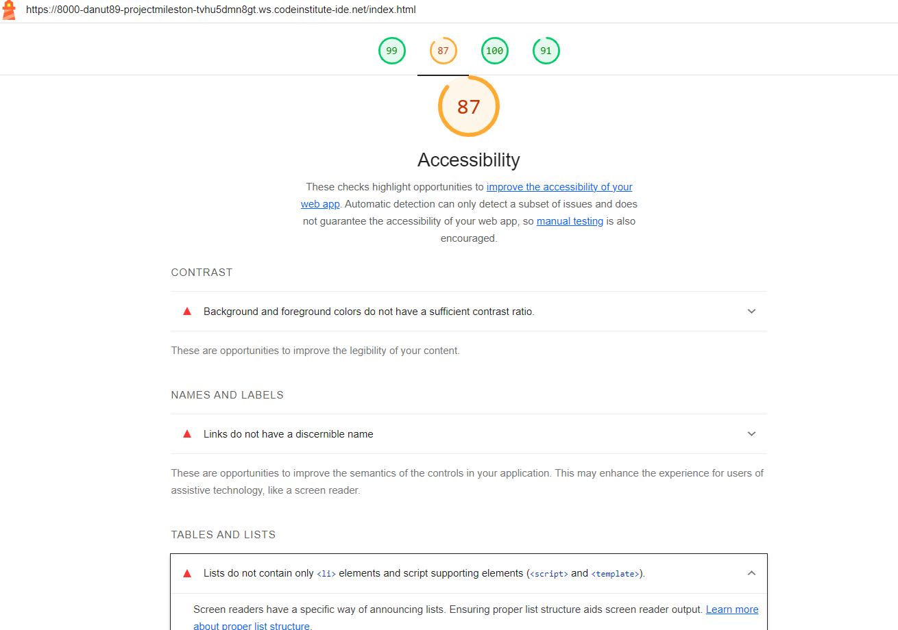
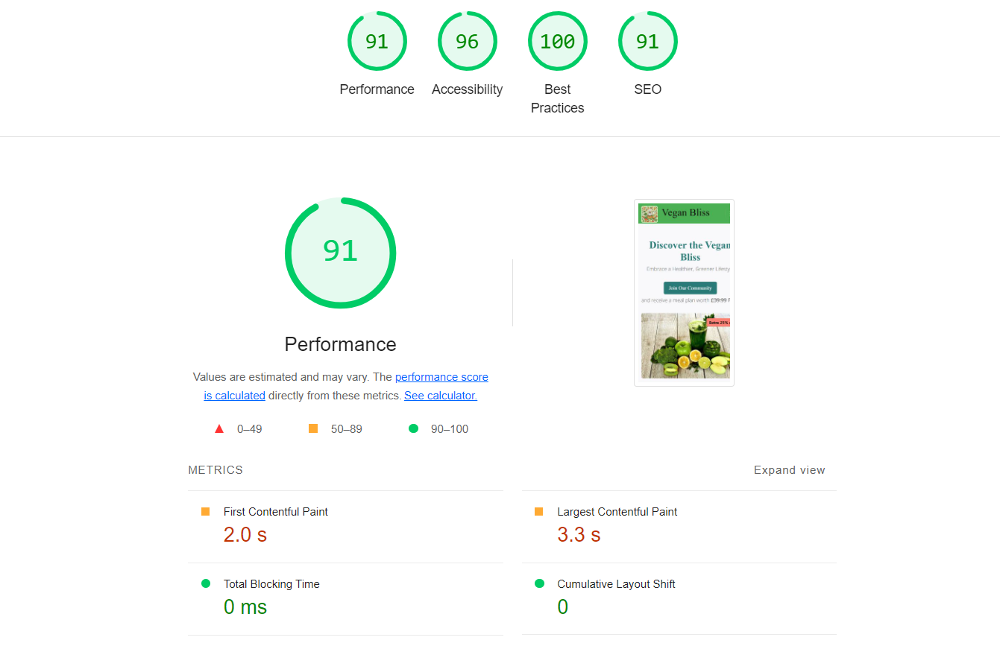

# Vegan Bliss

### Introduction

Welcome to Vegan Bliss, your ultimate destination for embracing a healthier and greener lifestyle through delicious plant-based recipes and insightful tips on vegan living. 
Explore our curated collection of vegan recipes, learn about the health benefits of a vegan diet, and join our vibrant community dedicated to making a positive impact on the planet. We believe that veganism is not just a diet but a lifestyle that fosters compassion, health, and environmental stewardship.

## User Experience (UX)

### Project Goals
The primary goal of Vegan Bliss is to provide users with an engaging platform to discover vegan recipes, learn about the benefits of a vegan diet, and get tips on vegan meal preparation.

### User Stories

### Target Audience
- Individuals looking to adopt a vegan lifestyle
- People seeking healthy and nutritious vegan recipes
- Individuals interested in the health benefits of a plant-based diet
- Those looking for efficient vegan meal prep tips

### General Visitors
- **As a user**, I want to easily navigate through different sections of the website.
- **As a user**, I want to find a variety of vegan recipes that are easy to make.
- **As a user**, I want to learn about the health benefits of a vegan diet.
- **As a user**, I want to get tips on how to prepare vegan meals efficiently.

#### First Time Visitor Goals
- **As a First Time Visitor,** I want to easily understand the main purpose of the site and learn more about the benefits of a vegan lifestyle.
- **As a First Time Visitor,** I want to be able to easily navigate throughout the site to find content on vegan recipes and health tips.
- **As a First Time Visitor,** I want to find detailed information about vegan meal prep tips and the health benefits of a vegan diet.

#### Returning Visitor Goals
- **As a Returning Visitor,** I want to easily access the section of the site where I can contact the organization with queries.
- **As a Returning Visitor,** I want to easily access the section of the site where I can download vegan recipes.
- **As a Returning Visitor,** I want to locate the business's social media links to see their followings on social media to determine how trusted and known they are, and potentially look for testimonials on these sites to understand how previous users have benefited from the content.

#### Frequent User Goals
- **As a Frequent User,** I want to be able to access the site easily from any device, even if I am on the go.
- **As a Frequent User,** I want to follow Vegan Bliss on their social pages so I am aware of any updates or new recipes.
- **As a Frequent User,** I want to have quick access to new and updated recipes and health tips.

### Site Owner Goals
- **As a site owner,** I want to create an attractive and well-designed site that elicits a positive emotional response in users so that they remain on and navigate throughout the site to achieve their goals.
- **As a site owner,** I want to have a clear and well-structured contact form so I can receive queries and questions from users which will potentially lead to more engagement.
- **As a site owner,** I want to have clear social media links displayed on the site which may lead to an increased following on channels to help with my branding.

## Features

### General Features
- **Responsive Design**: Ensures a seamless user experience across all devices, from desktops to mobile phones.
- **Navigation Bar**: Easy-to-use navigation bar with links to different sections of the site, ensuring smooth navigation.
- **Hero Section**: Engaging hero section with an attractive background image, compelling title, and a prominent call-to-action 
                    button.
- **Footer**: Informative footer with social media links, providing additional ways for users to connect.

### Specific Features

- **Recipe Section**: 
  - **Variety of Recipes**: Showcases a diverse range of vegan recipes, each with detailed instructions and images.
  - **Downloadable Recipes**: Allows users to download recipes in PDF format for offline use.
  - **Interactive Modals**: Provides additional information through modal popups, enhancing the user experience.

- **Health Benefits**: 
  - **Informative Content**: Detailed information on the health benefits of a vegan diet, including weight loss, improved 
                             digestion, and more.
  - **Embedded Videos**: Engaging video content to complement the textual information.

- **Meal Prep Tips**: 
  - **Efficient Planning**: Tips on how to effectively plan and prepare vegan meals, ensuring balanced nutrition.
  - **Nutritional Information**: Nutritional breakdowns for each meal, helping users make informed choices.

### Interactive Features
- **Contact Form**: 
  - **User-Friendly Form**: Allows users to easily send inquiries or feedback.
  - **Google Maps Integration**: Embedded Google Maps to show the physical location of the business.
- **Scroll Animations**: Smooth scroll animations for a more dynamic and engaging user experience.

### Advanced Features
- **Parallax Scrolling**: Parallax effect in the hero section, creating a modern and visually appealing experience.
- **Custom Animations**: Various CSS animations for buttons and images to draw attention and improve user interaction.

## Structure

The site has 4 main pages:

### Home Page
- **Hero Image**: Features a visually appealing hero image of vegan dishes.
- **Call to Action**: Includes an eye-catching call to action button directing users to the Contact page.
- **About Us**: Contains a brief introduction and background of Vegan Bliss.

### Recipes Page
- **Recipe Listings**: Showcases a variety of vegan recipes with images and detailed instructions.
- **Download Options**: Provides downloadable recipes in PDF format.
- **Interactive Modals**: Contains modals for additional recipe details.

### Lifestyle Page
- **Health Benefits**: Information about the health benefits of a vegan diet, including weight loss and improved digestion.
- **Meal Prep Tips**: Tips on efficiently planning and preparing vegan meals.
- **Embedded Videos**: Includes videos for more engaging content.

### Contact Page
- **Contact Form**: A user-friendly form for inquiries and feedback.
- **Google Maps Integration**: Displays a map for the physical location.
- **Contact Information**: Lists phone number, address, and email.

For consistency of user experience, the site logo, navigation links, and footer remain consistent throughout the site.

## Design

### Colour Scheme
The colour palette was chosen using the Coolors colour generator website to reflect the fresh and natural vibe of Vegan Bliss.
The website uses a fresh and natural color palette that reflects the vegan lifestyle, including shades of green, beige, and white.

The colours mainly used were:
- **White**: #ffffff
- **Green**: #4CAF50
- **Black**: #000000
- **Salmon**: #FA8072
- **Light Grey**: #f8f9fa
- **Teal**: #2b7a78
- **Dark Grey**: #4a4a4a
- **Medium Grey**: #555555

### Typography
- **Primary Font**: 'Roboto', taken from Google Fonts, is used throughout the website for its readability and modern look.
- **Secondary Font**: 'Open Sans', also from Google Fonts, is used for headers to create a clear distinction between content areas.

### Imagery
- All images were sourced from [Pexels](https://www.pexels.com/), [Pixabay](https://www.pixabay.com/), and [Unsplash](https://www.unsplash.com/).
- The main image on the home page features vibrant vegan dishes, intended to attract and engage visitors.
- Images on the Recipes page provide a visual preview of each dish, encouraging users to explore the recipes.
- The Contact page includes a Google Maps embed for easy location identification.

## Wireframes

Mock-ups were made using Balsamiq and Figma to help plan and visualize the site design. They were created for 3 main screen sizes: mobile, tablet, and desktop.

- [Wireframes: Home Page](link-to-home-page-wireframe)
- [Wireframes: Recipes Page](link-to-recipes-page-wireframe)
- [Wireframes: Lifestyle Page](link-to-lifestyle-page-wireframe)
- [Wireframes: Contact Page](link-to-contact-page-wireframe)

## Features To Be Implemented in Future

- **User Accounts**: Implement user accounts where visitors can save their favorite recipes, create shopping lists, and track their dietary progress.
- **Recipe Rating System**: Add a feature allowing users to rate and review recipes, helping others find the best dishes.
- **Interactive Meal Planner**: Develop a tool for users to plan their meals for the week, integrating it with the recipes available on the site.
- **Video Tutorials**: Incorporate video tutorials for recipes and meal prep tips to offer a more interactive learning experience.
- **Live Chat Support**: Add a live chat feature for instant support and advice on veganism and meal preparation.
- **Community Forum**: Create a community forum where users can share their experiences, tips, and recipes, fostering a sense of community.
- **E-commerce Integration**: Integrate an e-commerce platform for users to purchase vegan ingredients and products directly from the site.
- **Additional Recipes**: Continuously update the site with new and diverse vegan recipes to keep the content fresh and engaging.
- **Enhanced Meal Prep Tips**: Provide more detailed meal prep tips and nutritional advice to help users maintain a balanced vegan diet.

## Technologies Used

### Front-End Technologies
- **HTML5**: For structuring the content of the website.
- **CSS3**: For styling the website and creating responsive designs.
- **Bootstrap 5**: For building responsive, mobile-first websites quickly and easily.
- **JavaScript**: For adding interactive features and functionality to the website.
- **Font Awesome**: For adding vector icons and social logos.

### Development Tools
- **Gitpod**: The code editor used for developing the website.
- **Git**: For version control and collaboration.
- **GitHub**: For hosting the project repository and managing version control.
- **Visual Studio Code**: another development environment.
- **Figma**: For creating wireframes and design prototypes.
- **Balsamiq**: For creating wireframes and mockups.
- **W3C Validator**: For validating code
- **Squoosh**: For resing images

### Additional Resources
- **Color Pallet Generator**: For selecting the website's color scheme.
- **Unsplash, Pixabay, Pexels**: Sources for high-quality images used throughout the website.
- **Toolbaz** : For generating content

## Deployment

### Deploying to GitHub Pages
The site was developed in GitPod and deployed to GitHub Pages. The steps to deploy are as follows:

1. Navigate to the GitHub repository. For this project, this is [Danut89/ProjectMilestone1-Vegan-Bliss](https://github.com/Danut89/ProjectMilestone1-Vegan-Bliss).
2. Navigate to the **Settings** tab, then to **Pages**.
3. From the **Source** section drop-down menu, select the `main` branch (or `Branch: main` and `root` folder). Save.
4. Once the `main` branch has been selected, you will see the message: "Your site is published" and a link to the deployed site will be provided.

The live link can be found here - [Vegan Bliss](https://Danut89.github.io/ProjectMilestone1-Vegan-Bliss/)

### Forking the GitHub Repository
You can create a fork (copy) of the repository. This allows you to experiment with the code without affecting the original project.

To fork the repository:
1. Log in to your GitHub account.
2. On GitHub, navigate to the repository you want to fork.
3. In the top right corner of the page, underneath your profile avatar, click **Fork**.
4. You should now have a copy of the original repository in your GitHub account.

### Making a Local Clone
You can clone your repository to create a local copy on your computer. Any changes made to the local copy will not affect the original project. To clone the Vegan Bliss project, follow the steps below:

1. Log in to your GitHub account and locate the Vegan Bliss repository.
2. In the repository, click on the **Code** button located above all the project files.
3. Under HTTPS, copy the link generated - `https://github.com/Danut89/ProjectMilestone1-Vegan-Bliss.git`
4. Open the terminal you are using, e.g., GitPod.
5. Change the current working directory to the location where you want the cloned directory created.
6. Type `git clone` and then paste the URL you copied earlier: `git clone https://github.com/Danut89/ProjectMilestone1-Vegan-Bliss.git`
7. Press Enter to create your local clone.

## Testing

### Code Validation
- **HTML Validation**: All HTML files were checked and validated using the W3C Markup Validation Service.
- **CSS Validation**: All CSS files were checked and validated using the W3C CSS Validation Service.

### Browser Compatibility
The website was tested across multiple browsers to ensure compatibility and responsiveness:
- **Google Chrome**
- **Mozilla Firefox**
- **Safari**
- **Microsoft Edge**

### Responsiveness
The website's responsiveness was tested on various devices and screen sizes:
- **Desktop**
- **Tablet**
- **Mobile**

### User Testing
User testing was conducted to gather feedback and improve the website's usability:
- **Test 1**: Navigation and ease of use
- **Test 2**: Functionality of interactive elements (e.g., modals, contact form)
- **Test 3**: Overall user experience

## Testing

### Performance and Accessibility Testing

To ensure the website provides an optimal user experience, I conducted thorough testing using Lighthouse in Chrome Developer Tools. The tests focused on performance, accessibility, best practices, and SEO.

#### Desktop Performance and Accessibility Test

- **Performance**: Achieved a score of 99. Improvements were made by optimizing images, adding width and height attributes, and minifying CSS and JavaScript files.
- **Accessibility**: Scored 96, with enhancements such as adding aria-labels to links and buttons to improve screen reader compatibility.
- **Best Practices**: Scored 100, ensuring the site follows web standards and best practices.
- **SEO**: Scored 91, indicating good search engine optimization but with room for further improvements.

#### Mobile Performance and Accessibility Test

- **Performance**: Initial test scored 84. Improvements were needed in reducing the Largest Contentful Paint (LCP) and optimizing images.
- **Accessibility**: Scored 96, similar to the desktop version.
- **Best Practices**: Scored 100, maintaining web standards.
- **SEO**: Scored 91, consistent with the desktop version.

- **Performance**: Subsequent optimizations improved the score to 91. This was achieved by further reducing image sizes, enabling text compression, and eliminating render-blocking resources.

g
- **Performance**: Final optimizations resulted in a score of 99. This was done by ensuring all images are properly sized, minifying CSS and JavaScript files, and leveraging browser caching.

### Specific Improvements Made

1. **Image Optimization**:
    - Converted images to WebP format for better compression and faster loading times.
    - Added width and height attributes to all images to avoid layout shifts.

2. **Aria-labels**:
    - Added aria-labels to all interactive elements such as links and buttons to improve accessibility for screen reader users.

3. **Minifying CSS and JavaScript**:
    - Minified all CSS and JavaScript files to reduce file sizes and improve load times.

4. **Leveraging Browser Caching**:
    - Implemented browser caching for static assets to reduce server load and improve repeat visit performance.

5. **Eliminating Render-Blocking Resources**:
    - Deferred non-critical JavaScript to ensure faster initial page load.

6. **Text Compression**:
    - Enabled text compression to reduce the amount of data transferred over the network.

These steps significantly enhanced both the performance and accessibility of the website, ensuring a smooth and efficient user experience across all devices.

### Ongoing Testing
Continuous testing and user feedback are being gathered to improve and update the website regularly.

## Bugs

### Bugs and Fixes
- **Bug 1**: Issue with the navigation bar not collapsing on mobile devices.
  - **Fix**: Updated the Bootstrap classes and JavaScript code to ensure proper functionality.
- **Bug 2**: Images overlapping text in some sections.
  - **Fix**: Adjusted CSS styles to ensure proper spacing and layout.
- **Bug 3**: Contact form not submitting properly.
  - **Fix**: Corrected the Formspree integration and tested with various inputs.

### Fixed:
- **Image Overlap Issue**: Fixed an issue where images were overlapping with text on certain sections by adjusting CSS styles.
- **Form Submission Error**: Corrected the contact form submission by properly integrating Formspree.
- **Navigation Bar Responsiveness**: Resolved an issue where the navigation bar did not collapse properly on mobile devices.
- **Button Alignment**: Ensured consistent button alignment across different browsers and devices by updating CSS.

### Known:
- **Map Alignment**: On medium-sized devices, the Google Map on the contact page does not center perfectly over the contact details. This requires further adjustment in CSS.
- **Recipe Modal Overflow**: Some recipe modals may overflow on smaller screens, requiring further adjustments to modal sizes.

## Credits

### Content
- The recipes and health information were sourced and adapted from various vegan food blogs and websites.
- Content generation assistance provided by [Toolbaz](https://www.toolbaz.com).

### Media
- Images used in this project were sourced from [Pexels](https://www.pexels.com/), [Pixabay](https://www.pixabay.com/), and [Unsplash](https://www.unsplash.com/).

### Acknowledgements
- **Code Institute**: For the learning platform and guidance throughout the project.
- **Coolors**: For the color palette generation used in the design.
- **Font Awesome**: For the icons used in the website.
- **Bootstrap**: For the responsive design framework.
- **Google Fonts**: For the typography used in the website.
- **Formspree**: For handling form submissions.
- **The Vegan Society**: For inspiration and resources related to veganism.

### Development Tools
- **GitPod**: For the online development environment.
- **Visual Studio Code**: For the code editor.
- **Git**: For version control.
- **GitHub**: For hosting the project repository.
- **Figma**: For creating wireframes and design prototypes.
- **Balsamiq**: For creating wireframes and mockups.

### Special Thanks
- Special thanks to friends and family for their support and feedback during the development of this project.
